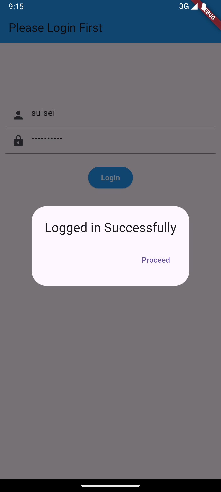
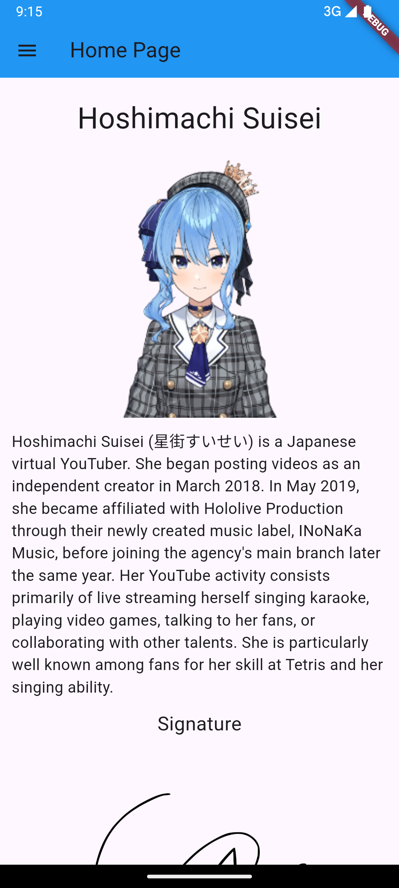
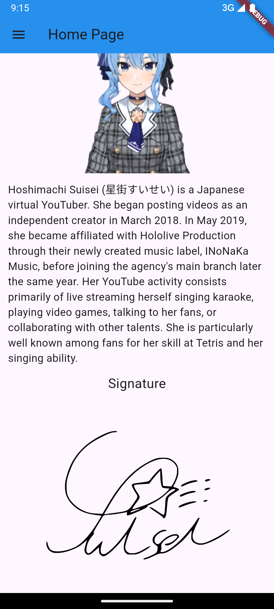
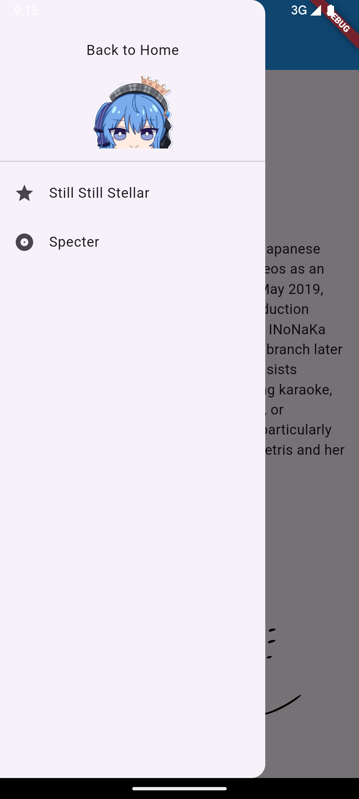
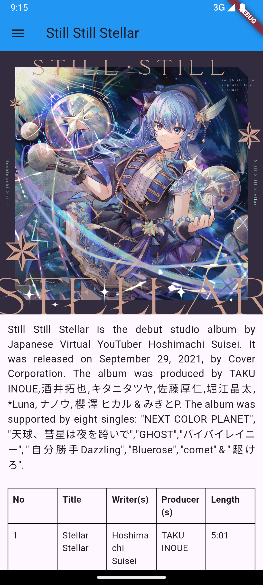
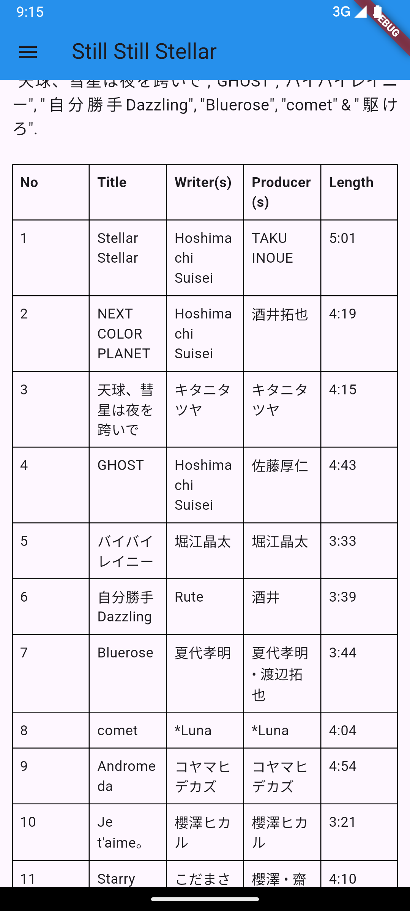
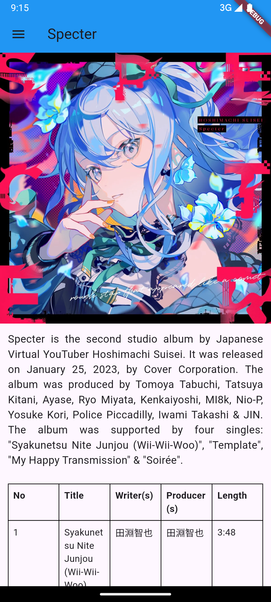
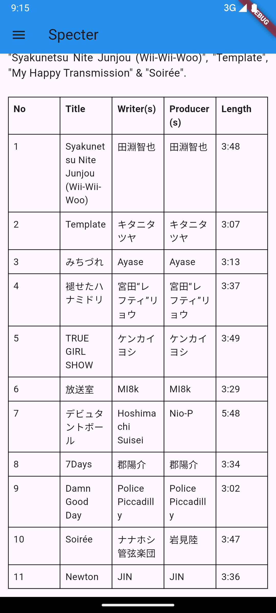

## Tugas3Praktikum2024

Nama       : Nicholas Hasian

NIM        : H1D022053

Shift Baru : C

Bagian-bagian penting dari project ini hampir sama dengan contoh, hanya ditambahkan 1 page baru dan beberapa modifikasi tampilan

### Screenshot Aplikasi

 
 
 
 
 
 
 
 

